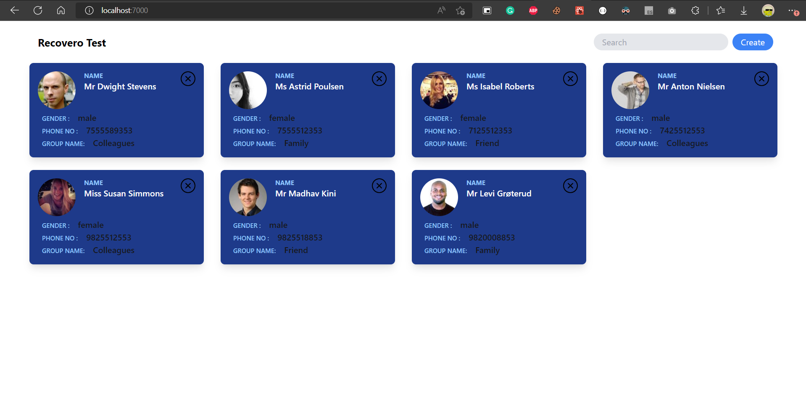
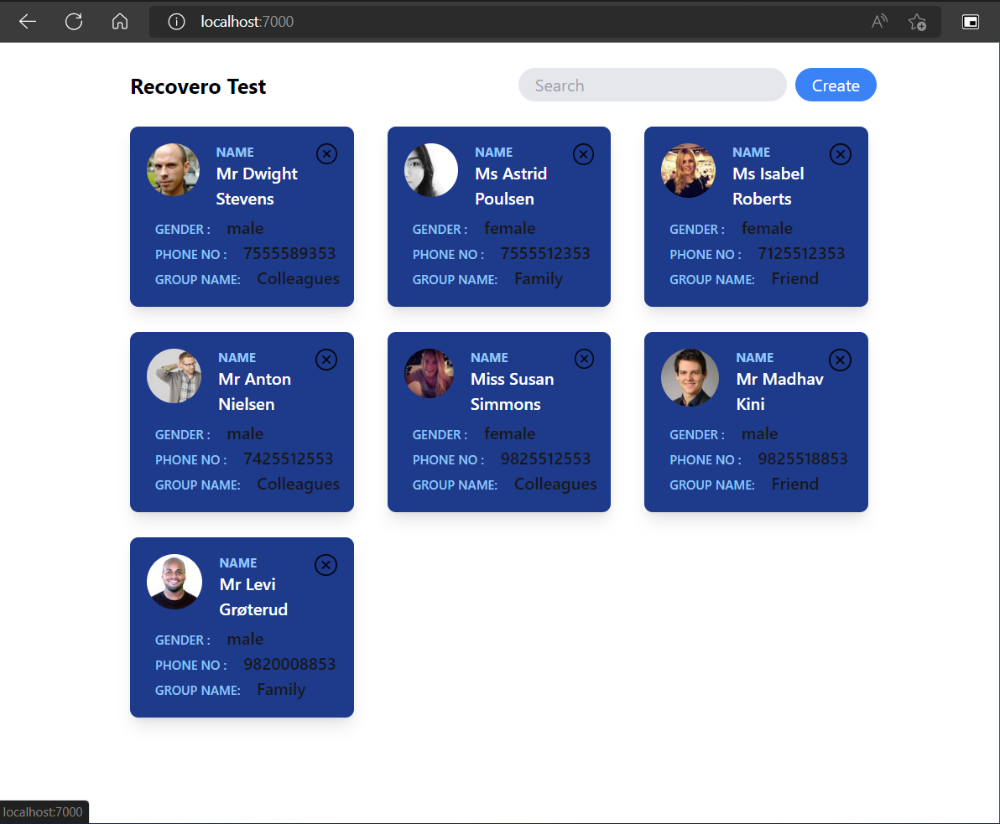
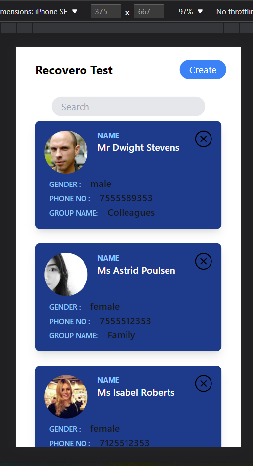
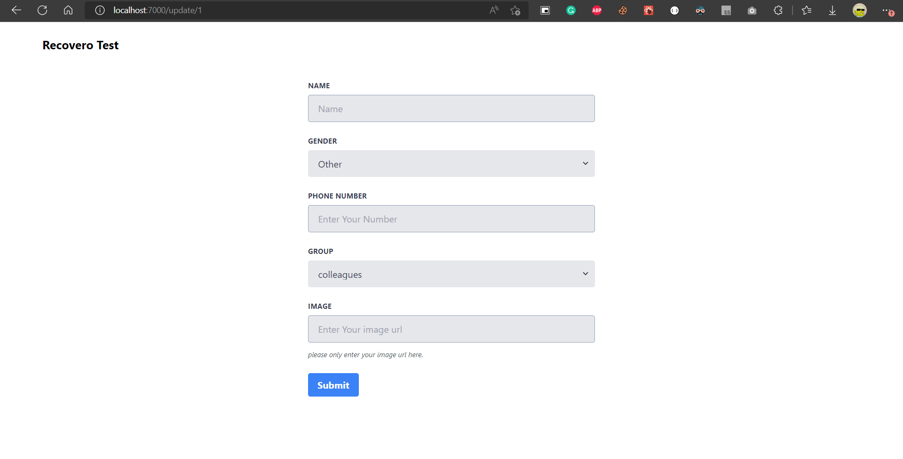
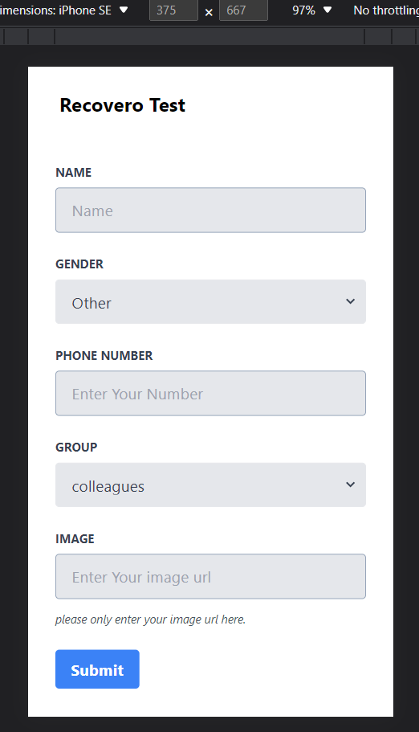

# Recovero Project

## Folder Structure

```
frontend
├─ .gitignore
├─ githubreadme
│  ├─ 1.png
│  ├─ 2.png
│  ├─ 3.png
│  ├─ 4.png
│  └─ 5.png
├─ package-lock.json
├─ package.json
├─ postcss.config.js
├─ public
│  ├─ favicon.ico
│  ├─ index.html
│  ├─ manifest.json
│  └─ robots.txt
├─ README.md
├─ src
│  ├─ App.js
│  ├─ component
│  │  ├─ Card.js
│  │  ├─ Form.js
│  │  ├─ Header.js
│  │  └─ Search.js
│  ├─ helper
│  │  └─ userData.json
│  ├─ index.css
│  ├─ index.js
│  ├─ page
│  │  ├─ CreatePage.js
│  │  └─ HomePage.js
│  └─ providers
│     └─ DataProvider.js
└─ tailwind.config.js

```

## Some ScreenShots of Project

### Home Page Desktop View



### Home Page Tablet View



### Home Page Mobile View



### Create/Update Page Desktop View



### Create/Update Page Mobile View


